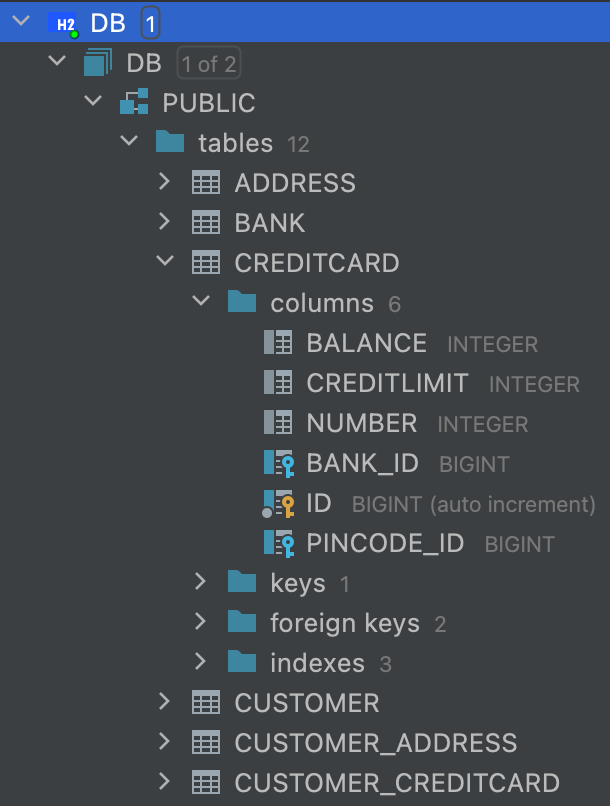

# GITHUB URL: 
### https://github.com/danielnyvoll/dat250-expass2

The database used is given by this line of code:
```xml
<property name="hibernate.dialect" value="org.hibernate.dialect.H2Dialect"/>
```
The database is H2 and is configured to store its files in the current directory with the name "DB" and is indicated by the following property:

```xml
<property name="hibernate.connection.url" value="jdbc:h2:file:./DB;DB_CLOSE_DELAY=-1"/>

```
It will create a local H2 database file named DB in the current working directory (./DB).

Additionally, the property "DB_CLOSE_DELAY=-1" ensures that the H2 Database remains open indefinitely, even if the last connection is closed. This means the database will not be automatically closed after the last connection is closed.


Since the hibernate.hbm2ddl.auto is set to "create" in the persistence.xml, Hibernate will generate the SQL schema for our entities automatically. This means that we won't need to write the SQL schema.

By setting the hibernate.show_sql property to true, Hibernate will print out the SQL statements it generates to the console.
```xml
<property name="hibernate.show_sql" value="true"/>
```
In the console then we get this output:
```sql
Hibernate: 
    create table Customer (
        id bigint generated by default as identity,
        name varchar(255),
        primary key (id)
    )
```

I had problems with see the database and the values init. By executing the sql command that was printed in the console I ended up with this DB view:

