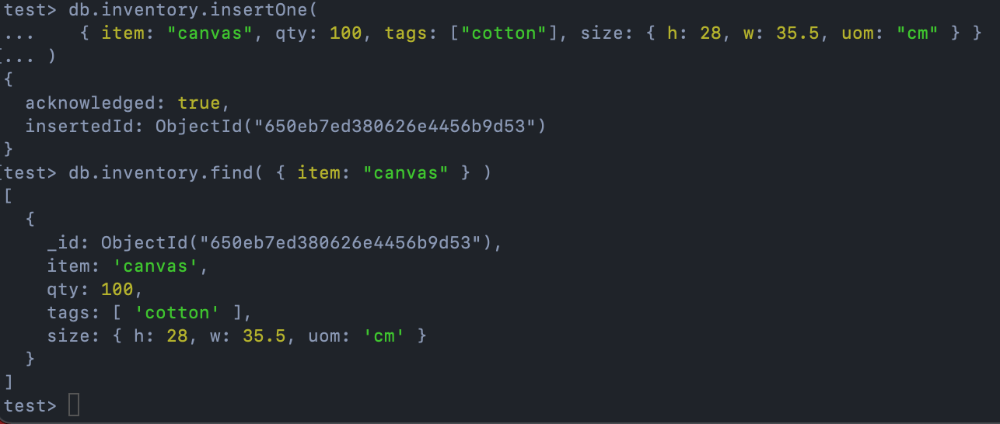

# MongoDB Installation and Usage Report
## Technical Problems During Installation
During the installation and usage of MongoDB, a few technical problems were encountered and resolved. Here's an overview of the issues and their solutions:

### Trouble First Confirmation

**Problem**: The initial MongoDB setup was causing issues with the first confirmation step, preventing successful installation.

**Solution**: To resolve this, we double-checked the installation instructions and ensured that the MongoDB service was running properly. We also verified that the necessary permissions and firewall rules were in place to allow MongoDB to function correctly.
## Update Many Command:

The MongoDB updateMany() command allows users to efficiently update multiple documents in a collection based on specified criteria. It is a powerful tool for making bulk changes to data.

## Delete Many Command:

The MongoDB deleteMany() command is used to remove multiple documents from a collection that match specified conditions. It provides a straightforward way to delete multiple records in one operation.

## Confirmation Set-Up

**Problem**: During the confirmation and set-up process, we encountered minor configuration issues that affected the database's connectivity.

**Solution**: We reviewed the MongoDB configuration files and made necessary adjustments to ensure that the MongoDB server was correctly configured for our environment. This included specifying the correct host and port settings.

## Experiment 2: Map-Reduce Operations
In Experiment 2, we implemented Map-Reduce operations in MongoDB to gain insights from our dataset. The primary focus was on calculating the average price per customer. Here are the details:

### Map-Reduce Operation 1: Average Price per Customer

**Task**: Calculate the average price per customer.

**Map Function**: Emit customer IDs and order prices.

**Reduce Function**: Calculate the total price and count of orders per customer.

**Results**: The outcome was stored in the "average_price_per_customer" collection.

**Additional Map-Reduce Operation**: Total Price per Customer
Insert and Find Command

**Task**: Calculate the total price per customer.
**Map Function**: Emit customer IDs and order prices.
**Reduce Function**: Sum the order prices for each customer.
**Results**: The outcome was stored in the "map_reduce_example" collection.

## Conclusion
Through this report, we've discussed the technical issues faced during MongoDB installation and usage. These issues were resolved by reviewing and adjusting configuration settings.

Additionally, we explored Experiment 2, where we conducted Map-Reduce operations to analyze our data. We calculated both the average price and total price per customer, which provide valuable insights for business decision-making.

Overall, MongoDB's Map-Reduce capabilities proved to be effective in summarizing and analyzing large datasets, contributing to better data-driven decisions.

