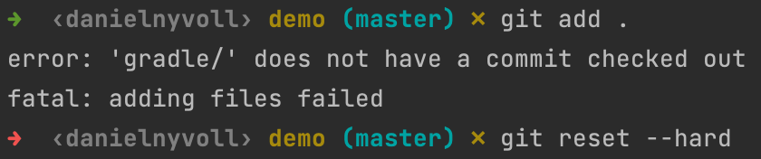

During the completion of the Spring Boot project, I encountered several technical challenges that influenced the progression of the tutorial. The primary hurdle involved the setup of Git, particularly when dealing with a .zip file containing the project. The initial setup posed difficulties as I navigated through the intricacies of version control with compressed files.

In one instance, I sought assistance from ChatGPT, and it recommended using the git reset --hard command.

Unfortunately, this led to an unintended consequence, and the entire project was deleted. This unexpected turn presented a significant setback, and I had to navigate the complexities of Git recovery processes to restore the project.

For transparency and collaboration, I have shared the code for the completed experiments (1-4) on GitHub. You can access the repository at [GITHUB](https://github.com/danielnyvoll/Dat250-Boot). This repository includes the codebase for the experiments conducted during the tutorial.

Despite the challenges faced, the completion of the assignment was a valuable learning experience. However, there may still be pending issues that I did not manage to resolve entirely. I am actively working on addressing any outstanding problems and will continue to refine the project to meet the required standards.

